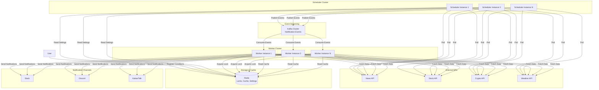
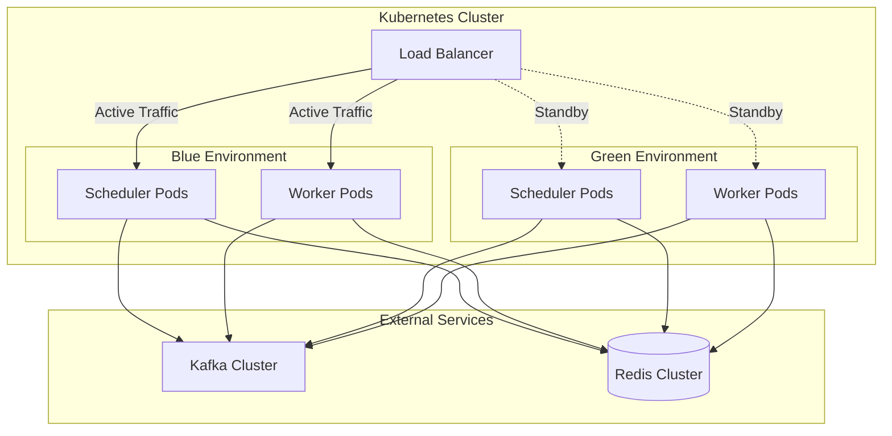

# Design Document: Alarm News System

## Overview

The Alarm News system is a distributed, event-driven notification service that monitors external APIs (news, stock prices, weather, cryptocurrency) and delivers personalized alerts through multiple channels (Slack, Discord, KakaoTalk). The system is designed for high availability with zero-downtime deployments using blue/green strategies on Kubernetes.

### Key Design Goals

1. **Exactly-once notification delivery**: Prevent duplicate notifications during deployments and failures
2. **External API resilience**: Handle rate limits, timeouts, and failures gracefully
3. **Zero-downtime deployments**: Support blue/green deployment without notification loss
4. **Scalability**: Distribute workload across multiple instances using Kafka consumer groups
5. **Low latency**: Deliver notifications within seconds of condition satisfaction

### System Context

The system consists of two primary components:

- **Scheduler**: Evaluates user-defined conditions by polling external APIs and publishes notification events to Kafka
- **Worker**: Consumes notification events from Kafka, enriches data from external APIs, and delivers notifications to user-configured channels

External dependencies include:
- **Kafka**: Event streaming platform for decoupling scheduler and workers
- **Redis**: Distributed locking, caching, and user settings storage
- **External APIs**: News, stock, weather, and cryptocurrency data providers
- **Notification channels**: Slack, Discord, KakaoTalk webhooks/APIs

## Architecture

### High-Level Architecture



### Component Responsibilities

#### Scheduler

**Primary Responsibilities:**
- Load and reload user conditions from Redis every 1 minute
- Poll external APIs at configured intervals (1 minute for stock, 5 minutes for news)
- Evaluate conditions against fetched data
- Publish notification events to Kafka when conditions are satisfied
- Distribute workload using consistent hashing based on user identifiers

**Key Design Decisions:**
- **Stateless design**: All state stored in Redis for horizontal scalability
- **Consistent hashing**: Ensures each user's conditions are evaluated by the same scheduler instance, reducing duplicate API calls
- **Graceful degradation**: Continue with cached settings if Redis is temporarily unavailable

#### Worker

**Primary Responsibilities:**
- Consume notification events from Kafka consumer group
- Acquire distributed lock to prevent duplicate processing
- Fetch enriched data from external APIs or cache
- Format and deliver notifications to user-configured channels
- Handle retries and dead letter queue for failed notifications

**Key Design Decisions:**
- **Manual offset commit**: Commit Kafka offsets only after successful notification delivery
- **Distributed locking**: Use Redis SET NX EX for lock acquisition with 5-minute TTL
- **Graceful shutdown**: Stop consuming new messages on SIGTERM, complete in-flight notifications within 60 seconds

### Deployment Architecture



**Blue/Green Deployment Flow:**
1. Green environment starts and passes readiness probes (Kafka and Redis connectivity)
2. Green workers join Kafka consumer group but initially receive no messages (blue still processing)
3. Traffic switches to green environment
4. Blue environment receives SIGTERM, stops consuming new Kafka messages
5. Blue workers complete in-flight notifications within 60-second grace period
6. Kafka rebalances, green workers take over all partitions
7. Blue environment terminates

## Components and Interfaces

### Scheduler Component

#### User Condition Loader

**Interface:**
```typescript
interface UserConditionLoader {
  loadConditions(): Promise<UserCondition[]>
  reloadConditions(): Promise<void>
}

interface UserCondition {
  userId: string
  conditionId: string
  type: 'time-based' | 'threshold-based'
  parameters: TimeBasedParams | ThresholdBasedParams
  notificationChannel: NotificationChannel
}

interface TimeBasedParams {
  hour: number  // 0-23
  minute: number  // 0-59
  keywords?: string[]
  stockSymbols?: string[]
}

interface ThresholdBasedParams {
  assetId: string
  thresholdValue: number
  operator: 'above' | 'below'
  keywords?: string[]  // For combined alerts
}
```

**Responsibilities:**
- Load all user conditions from Redis on startup
- Reload conditions every 1 minute to detect changes
- Validate condition parameters
- Distribute conditions across scheduler instances using consistent hashing

**Implementation Notes:**
- Use Redis SCAN for efficient iteration over user settings keys
- Cache conditions in memory between reload intervals
- Handle Redis connection failures by continuing with cached conditions

#### External API Poller

**Interface:**
```typescript
interface ExternalAPIPoller {
  pollNews(): Promise<NewsArticle[]>
  pollStockPrices(symbols: string[]): Promise<StockPrice[]>
  pollCryptoPrices(symbols: string[]): Promise<CryptoPrice[]>
  pollWeather(locations: string[]): Promise<WeatherData[]>
}

interface NewsArticle {
  id: string
  title: string
  body: string
  url: string
  publishedAt: Date
  source: string
}

interface StockPrice {
  symbol: string
  price: number
  previousClose: number
  timestamp: Date
}
```

**Responsibilities:**
- Poll external APIs at configured intervals
- Handle API rate limits and retries with exponential backoff
- Track article IDs in Redis to prevent duplicate notifications
- Store previous prices in Redis for threshold comparison

**Implementation Notes:**
- Use separate polling loops for different API types (1 minute for stock, 5 minutes for news)
- Implement circuit breaker pattern for failing APIs
- Respect Retry-After and X-RateLimit-Reset headers

#### Condition Evaluator

**Interface:**
```typescript
interface ConditionEvaluator {
  evaluateTimeBasedConditions(currentTime: Date, data: ExternalData): NotificationEvent[]
  evaluateThresholdConditions(data: ExternalData): NotificationEvent[]
}

interface NotificationEvent {
  eventId: string  // UUID for idempotency
  userId: string
  conditionId: string
  eventType: 'news' | 'stock' | 'combined'
  payload: NewsPayload | StockPayload | CombinedPayload
  timestamp: Date
}
```

**Responsibilities:**
- Match news articles against keyword subscriptions (case-insensitive substring)
- Compare stock prices against thresholds with previous price tracking
- Generate notification events for satisfied conditions
- Prevent duplicate notifications using Redis tracking

**Implementation Notes:**
- Use Redis SET for tracking processed article IDs (TTL: 7 days)
- Use Redis HASH for storing previous prices per asset
- Use Redis STRING for tracking threshold triggers (TTL: 10 minutes)

#### Event Publisher

**Interface:**
```typescript
interface EventPublisher {
  publishEvent(event: NotificationEvent): Promise<void>
  publishBatch(events: NotificationEvent[]): Promise<void>
}
```

**Responsibilities:**
- Publish notification events to Kafka with acks=all
- Retry failed publishes up to 3 times with 5-second intervals
- Log and discard events after retry exhaustion

**Implementation Notes:**
- Use Kafka producer with idempotent writes enabled
- Partition by userId for ordered processing per user
- Set request timeout to 30 seconds

### Worker Component

#### Event Consumer

**Interface:**
```typescript
interface EventConsumer {
  consumeEvents(handler: (event: NotificationEvent) => Promise<void>): void
  shutdown(): Promise<void>
}
```

**Responsibilities:**
- Consume events from Kafka consumer group
- Use manual offset commit mode
- Handle graceful shutdown on SIGTERM
- Trigger consumer group rebalancing

**Implementation Notes:**
- Set session.timeout.ms to 30 seconds for fast rebalancing
- Set max.poll.interval.ms to 5 minutes to allow processing time
- Commit offsets only after successful notification delivery

#### Distributed Lock Manager

**Interface:**
```typescript
interface DistributedLockManager {
  acquireLock(eventId: string, ttl: number): Promise<boolean>
  releaseLock(eventId: string): Promise<void>
}
```

**Responsibilities:**
- Acquire distributed lock using Redis SET NX EX
- Prevent duplicate processing during blue/green deployments
- Release lock after processing or on failure
- Handle lock acquisition timeouts

**Implementation Notes:**
- Use event ID as lock key: `lock:event:{eventId}`
- Set lock TTL to 5 minutes to prevent deadlocks
- Return false if lock already held (skip processing)
- Use Lua script for atomic lock release (check and delete)

**Redis Lock Pattern:**
```lua
-- Acquire lock
SET lock:event:{eventId} {workerId} NX EX 300

-- Release lock (atomic check and delete)
if redis.call("GET", KEYS[1]) == ARGV[1] then
    return redis.call("DEL", KEYS[1])
else
    return 0
end
```

#### API Cache Manager

**Interface:**
```typescript
interface APICacheManager {
  get(cacheKey: string): Promise<CachedData | null>
  set(cacheKey: string, data: any, ttl: number): Promise<void>
  getCacheKey(endpoint: string, params: Record<string, any>): string
}

interface CachedData {
  data: any
  cachedAt: Date
  expiresAt: Date
}
```

**Responsibilities:**
- Check cache before calling external APIs
- Return cached data if less than 10 minutes old
- Return stale cache (10-60 minutes) if API fails
- Store successful API responses with TTL
- Generate cache keys from endpoint and parameters

**Implementation Notes:**
- Use Redis STRING with JSON serialization
- Cache key format: `cache:api:{hash(endpoint+params)}`
- Adjust TTL to 15 minutes when rate limit threshold (80%) reached
- Do not cache error responses (4xx, 5xx)

#### Rate Limit Handler

**Interface:**
```typescript
interface RateLimitHandler {
  trackAPICall(apiEndpoint: string): Promise<void>
  handleRateLimitError(apiEndpoint: string, response: APIResponse): Promise<number>
  shouldIncreaseCache(apiEndpoint: string): Promise<boolean>
}

interface APIResponse {
  statusCode: number
  headers: Record<string, string>
}
```

**Responsibilities:**
- Track API call counts per endpoint using Redis sliding window
- Implement exponential backoff for rate limit errors (HTTP 429)
- Respect Retry-After and X-RateLimit-Reset headers
- Alert operators when 3+ rate limit errors occur within 5 minutes
- Dynamically adjust cache TTL based on rate limit proximity

**Implementation Notes:**
- Use Redis ZSET for sliding window: `ratelimit:{endpoint}` with timestamp scores
- Remove entries older than 1 minute using ZREMRANGEBYSCORE
- Exponential backoff: 1s, 2s, 4s, 8s, 16s, 32s, 60s (max)
- Check rate limit at 80% threshold to increase cache TTL

**Sliding Window Implementation:**
```lua
-- Track API call
local key = KEYS[1]
local now = ARGV[1]
local window = ARGV[2]  -- 60 seconds

redis.call('ZADD', key, now, now)
redis.call('ZREMRANGEBYSCORE', key, 0, now - window)
redis.call('EXPIRE', key, window)
return redis.call('ZCARD', key)
```

#### Notification Formatter

**Interface:**
```typescript
interface NotificationFormatter {
  formatNewsNotification(article: NewsArticle, keywords: string[]): string
  formatStockNotification(price: StockPrice, threshold: ThresholdBasedParams): string
  formatCombinedNotification(article: NewsArticle, price: StockPrice): string
  truncateForChannel(message: string, channel: NotificationChannel): string
}
```

**Responsibilities:**
- Format notification messages for different event types
- Include timestamp in ISO 8601 format
- Truncate article summaries to 500 characters
- Calculate and format price change percentages (2 decimal places)
- Truncate messages to channel size limits while preserving essential information

**Implementation Notes:**
- Preserve timestamp and alert type when truncating
- Round prices and percentages to 2 decimal places
- Include matched keywords in news notifications
- Format: `[{timestamp}] {alert_type}: {content}`

#### Notification Sender

**Interface:**
```typescript
interface NotificationSender {
  sendToSlack(webhook: string, message: string): Promise<void>
  sendToDiscord(webhook: string, message: string): Promise<void>
  sendToKakaoTalk(credentials: KakaoCredentials, message: string): Promise<void>
}

interface KakaoCredentials {
  accessToken: string
  chatId: string
}
```

**Responsibilities:**
- Send formatted notifications to user-configured channels
- Retry failed deliveries up to 3 times with 30-second intervals
- Handle network timeouts and HTTP errors
- Store failed notifications in dead letter queue after retry exhaustion

**Implementation Notes:**
- Set HTTP timeout to 10 seconds
- Retry on network errors and 5xx status codes
- Do not retry on 4xx errors (except 429)
- Dead letter queue: Kafka topic `notification-dlq`

## Data Models

### User Settings (Redis)

**Key Pattern:** `user:{userId}:settings`

**Data Structure:**
```json
{
  "userId": "user123",
  "conditions": [
    {
      "conditionId": "cond456",
      "type": "threshold-based",
      "assetId": "AAPL",
      "thresholdValue": 150.00,
      "operator": "above",
      "keywords": ["earnings", "revenue"]
    },
    {
      "conditionId": "cond789",
      "type": "time-based",
      "hour": 9,
      "minute": 0,
      "keywords": ["technology", "AI"]
    }
  ],
  "notificationChannel": {
    "type": "slack",
    "webhook": "https://hooks.slack.com/services/..."
  },
  "maxConditions": 100
}
```

### Processed Articles (Redis)

**Key Pattern:** `processed:article:{articleId}`

**Data Structure:** SET with TTL of 7 days
```
Value: "1" (presence indicates processed)
TTL: 604800 seconds (7 days)
```

### Previous Prices (Redis)

**Key Pattern:** `price:previous:{assetId}`

**Data Structure:**
```json
{
  "symbol": "AAPL",
  "price": 149.50,
  "timestamp": "2025-01-15T14:30:00Z"
}
```

### Threshold Triggers (Redis)

**Key Pattern:** `trigger:{userId}:{conditionId}:{assetId}`

**Data Structure:** STRING with TTL of 10 minutes
```
Value: "2025-01-15T14:35:00Z" (trigger timestamp)
TTL: 600 seconds (10 minutes)
```

### API Cache (Redis)

**Key Pattern:** `cache:api:{hash}`

**Data Structure:**
```json
{
  "endpoint": "https://api.news.com/articles",
  "params": {"category": "technology"},
  "data": [...],
  "cachedAt": "2025-01-15T14:30:00Z"
}
```
**TTL:** 600 seconds (10 minutes), adjustable to 900 seconds (15 minutes) under rate limit pressure

### Rate Limit Tracking (Redis)

**Key Pattern:** `ratelimit:{apiEndpoint}`

**Data Structure:** ZSET with timestamp scores
```
Member: timestamp (e.g., "1705329000123")
Score: timestamp (same value)
TTL: 60 seconds
```

### Distributed Lock (Redis)

**Key Pattern:** `lock:event:{eventId}`

**Data Structure:** STRING
```
Value: {workerId} (e.g., "worker-pod-abc123")
TTL: 300 seconds (5 minutes)
```

### Kafka Topics

#### Notification Events Topic

**Topic Name:** `notification-events`

**Configuration:**
- Partitions: 12 (for parallelism)
- Replication Factor: 3
- min.insync.replicas: 2
- retention.ms: 86400000 (24 hours)

**Message Schema:**
```json
{
  "eventId": "evt-uuid-123",
  "userId": "user123",
  "conditionId": "cond456",
  "eventType": "combined",
  "payload": {
    "articleId": "art789",
    "stockSymbol": "AAPL",
    "keywords": ["earnings"]
  },
  "timestamp": "2025-01-15T14:35:00Z"
}
```

#### Dead Letter Queue Topic

**Topic Name:** `notification-dlq`

**Configuration:**
- Partitions: 3
- Replication Factor: 3
- retention.ms: 604800000 (7 days)

**Message Schema:**
```json
{
  "originalEvent": {...},
  "failureReason": "Slack webhook returned 404",
  "attemptCount": 3,
  "lastAttemptAt": "2025-01-15T14:40:00Z",
  "failedAt": "2025-01-15T14:42:00Z"
}
```


## Correctness Properties

### Property 0: Not Applicable

**Property-based testing is not applicable to this infrastructure orchestration system.**

*For any* component in this system, traditional property-based testing cannot be applied because the system consists of infrastructure orchestration with side effects rather than pure functions with testable input/output relationships.

**Validates: Requirements 0.0**

### Rationale: Why Property-Based Testing Is Not Applicable

This system is primarily an infrastructure orchestration platform with side effects, making traditional property-based testing unsuitable. Property-based testing works best for pure functions with clear input/output behavior where universal properties can be verified across many generated inputs.

**Reasons PBT Does Not Apply:**

1. **Infrastructure as Code**: The system deploys and manages Kubernetes resources, Kafka topics, and Redis data structures. These are declarative configurations, not functions with testable input/output relationships.

2. **Side-Effect-Only Operations**: Core operations include:
   - Publishing events to Kafka
   - Acquiring distributed locks in Redis
   - Sending notifications to external webhooks (Slack, Discord, KakaoTalk)
   - Polling external APIs with rate limits
   
   These operations have no return values to assert universal properties on, and their correctness depends on external system state.

3. **External Service Dependencies**: The system integrates with multiple external services (news APIs, stock APIs, notification channels) whose behavior is non-deterministic and cannot be meaningfully tested with generated inputs.

4. **Stateful Distributed System**: Correctness depends on distributed coordination (Kafka consumer groups, Redis locks, blue/green deployments) rather than mathematical properties that hold across all inputs.

**Alternative Testing Strategies:**

Instead of property-based testing, this system uses:

- **Integration Tests**: Verify Kafka, Redis, and external API interactions using Testcontainers and mocks
- **Contract Tests**: Validate external API request/response formats
- **Chaos Tests**: Verify resilience to infrastructure failures (Redis down, Kafka broker failure, pod termination)
- **End-to-End Tests**: Validate complete user workflows in staging environment
- **Load Tests**: Verify system handles expected scale (10,000 users, 100,000 conditions)
- **Deployment Tests**: Verify zero-downtime blue/green deployments with no notification loss or duplicates

These testing strategies are more appropriate for validating the correctness of a distributed, event-driven system with external dependencies and side effects.

## Error Handling

### External API Failures

**Failure Scenarios:**
1. **Timeout**: API does not respond within 30 seconds
2. **Rate Limit**: API returns HTTP 429
3. **Server Error**: API returns 5xx status code
4. **Client Error**: API returns 4xx status code (except 429)
5. **Network Error**: Connection refused, DNS failure, etc.

**Handling Strategy:**

| Scenario | Scheduler Behavior | Worker Behavior |
|----------|-------------------|-----------------|
| Timeout | Log error, retry on next poll interval | Use stale cache if available (10-60 min), otherwise fail notification |
| Rate Limit (429) | Exponential backoff (1s to 60s max), up to 5 retries, respect Retry-After header | Same as scheduler, adjust cache TTL to 15 minutes |
| Server Error (5xx) | Retry up to 3 times with 10-second intervals, then skip until next poll | Use stale cache if available, otherwise fail notification |
| Client Error (4xx) | Log error, skip retry (likely configuration issue) | Fail notification, send to dead letter queue |
| Network Error | Retry up to 3 times with 10-second intervals | Use stale cache if available, otherwise fail notification |

**Rate Limit Specific Handling:**
- Track rate limit errors in Redis: `ratelimit:errors:{endpoint}` (ZSET with 5-minute window)
- Alert operators when 3+ errors occur within 5 minutes
- Increase cache TTL from 10 to 15 minutes when API usage reaches 80% of limit
- Restore cache TTL to 10 minutes when usage drops to 50%

### Redis Failures

**Failure Scenarios:**
1. **Connection Failure**: Redis is unreachable
2. **Timeout**: Redis operation exceeds timeout
3. **Lock Acquisition Failure**: Cannot acquire distributed lock

**Handling Strategy:**

**Scheduler:**
- On startup: Retry connection every 10 seconds for up to 10 attempts, then fail
- During reload: Log warning, continue with previously loaded conditions
- On cache write failure: Log error, continue (cache is optional)

**Worker:**
- On lock acquisition timeout (10 seconds): Do not acknowledge Kafka message, allow redelivery
- On lock already held: Skip processing, acknowledge Kafka message (another worker is processing)
- On cache read failure: Fetch from external API directly
- On cache write failure: Log warning, continue (cache is optional)

### Kafka Failures

**Failure Scenarios:**
1. **Publish Failure**: Cannot publish event to Kafka
2. **Consumer Lag**: Worker cannot keep up with event rate
3. **Rebalancing**: Consumer group rebalancing during deployment

**Handling Strategy:**

**Scheduler:**
- Retry publish up to 3 times with 5-second intervals
- After retry exhaustion: Log error and discard event (condition will be re-evaluated on next poll)

**Worker:**
- On consumer lag: Scale horizontally by adding more worker instances
- During rebalancing: Kafka automatically reassigns partitions within 30 seconds
- On processing failure: Do not commit offset, allow redelivery after rebalancing

### Notification Delivery Failures

**Failure Scenarios:**
1. **Network Timeout**: Notification channel does not respond within 10 seconds
2. **Authentication Failure**: Invalid credentials (4xx)
3. **Server Error**: Notification channel returns 5xx
4. **Rate Limit**: Notification channel returns 429

**Handling Strategy:**

| Scenario | Retry Strategy | Final Action |
|----------|---------------|--------------|
| Network Timeout | 3 retries with 30-second intervals | Send to dead letter queue |
| Auth Failure (4xx) | No retry (except 429) | Send to dead letter queue, alert user |
| Server Error (5xx) | 3 retries with 30-second intervals | Send to dead letter queue |
| Rate Limit (429) | Exponential backoff, respect Retry-After | Send to dead letter queue after 3 attempts |

**Dead Letter Queue Processing:**
- Store failed notifications in Kafka topic `notification-dlq`
- Include original event, failure reason, attempt count, and timestamps
- Retention: 7 days for manual review and reprocessing
- Alert operators for manual intervention

### Graceful Degradation

**Scenarios:**

1. **All External APIs Down:**
   - Scheduler: Continue evaluating time-based conditions, skip threshold-based conditions
   - Worker: Use stale cache if available, otherwise send notifications to DLQ

2. **Redis Down:**
   - Scheduler: Continue with last loaded conditions, skip cache writes
   - Worker: Skip lock acquisition (risk of duplicates), fetch directly from APIs

3. **Kafka Down:**
   - Scheduler: Buffer events in memory (max 1000), retry publish
   - Worker: Cannot consume, wait for Kafka recovery

**Priority:** Prefer notification loss over duplicate notifications in extreme failure scenarios.

## Testing Strategy

### Unit Testing

**Scheduler Component:**
- User condition validation logic (valid/invalid parameters)
- Keyword matching algorithm (case-insensitive substring)
- Threshold comparison logic (above/below with previous price)
- Consistent hashing distribution
- Event ID generation for idempotency

**Worker Component:**
- Notification formatting (news, stock, combined)
- Message truncation logic (500 char summary, channel limits)
- Price change percentage calculation
- Cache key generation
- Lock acquisition/release logic

**Test Framework:** Jest (Node.js) or pytest (Python) or Go testing package

**Coverage Target:** 80% line coverage for business logic

### Integration Testing

**Kafka Integration:**
- Publish and consume events end-to-end
- Consumer group rebalancing behavior
- Manual offset commit after successful processing
- Dead letter queue message routing

**Redis Integration:**
- Distributed lock acquisition and release
- Lock TTL expiration (5 minutes)
- Cache read/write with TTL
- Sliding window rate limit tracking
- User settings CRUD operations

**External API Integration:**
- Mock external APIs with configurable responses (success, timeout, rate limit, error)
- Verify retry logic with exponential backoff
- Verify Retry-After header handling
- Verify cache hit/miss behavior

**Notification Channel Integration:**
- Mock Slack, Discord, KakaoTalk webhooks
- Verify message formatting and delivery
- Verify retry logic on failures
- Verify dead letter queue on exhaustion

**Test Framework:** Testcontainers for Kafka and Redis, WireMock for external APIs

**Test Scenarios:**
1. End-to-end notification flow (condition satisfied → event published → notification delivered)
2. Duplicate prevention with distributed locks
3. Cache hit reduces external API calls
4. Rate limit triggers exponential backoff
5. Failed notification goes to dead letter queue

### Load Testing

**Objectives:**
- Verify system handles expected load (10,000 users, 100,000 conditions)
- Identify bottlenecks in scheduler and worker components
- Validate Kafka throughput and consumer lag
- Validate Redis performance under load

**Test Scenarios:**
1. **Scheduler Load:**
   - 10,000 users with 10 conditions each
   - 50% time-based, 50% threshold-based
   - Measure: API poll latency, event publish rate, Redis read latency

2. **Worker Load:**
   - 1,000 events/second consumption rate
   - Measure: Processing latency, notification delivery rate, cache hit rate

3. **Blue/Green Deployment:**
   - Simulate deployment during peak load
   - Measure: Notification loss (should be 0), duplicate rate (should be 0)

**Tools:** k6 or Gatling for load generation, Prometheus for metrics collection

### Chaos Testing

**Objectives:**
- Verify system resilience to infrastructure failures
- Validate graceful degradation behavior
- Ensure no notification loss during failures

**Test Scenarios:**
1. **Redis Failure:**
   - Kill Redis during processing
   - Verify: Scheduler continues with cached conditions, worker skips locks (risk of duplicates acceptable)

2. **Kafka Failure:**
   - Kill Kafka broker during event publishing
   - Verify: Scheduler retries, events not lost

3. **External API Failure:**
   - Simulate API timeout, rate limit, 5xx errors
   - Verify: Retry logic, exponential backoff, stale cache usage

4. **Worker Pod Termination:**
   - Kill worker pod during notification processing
   - Verify: Kafka rebalances, event redelivered, no notification loss

**Tools:** Chaos Mesh or Litmus for Kubernetes chaos engineering

### End-to-End Testing

**Objectives:**
- Verify complete user workflows
- Validate blue/green deployment without notification loss or duplicates

**Test Scenarios:**
1. **User registers keyword subscription → news article published → notification delivered to Slack**
2. **User registers price threshold → stock price crosses threshold → notification delivered to Discord**
3. **User registers combined alert → news article published → notification includes stock price**
4. **Blue/green deployment during active notifications → no loss, no duplicates**

**Environment:** Staging environment with real Kafka, Redis, and mock external APIs

**Validation:**
- Notification delivered within 30 seconds of condition satisfaction
- No duplicate notifications during deployment
- All notifications accounted for (published events = delivered + DLQ)

### Monitoring and Observability Testing

**Objectives:**
- Verify health check endpoints return correct status
- Validate metrics are emitted correctly
- Ensure logs contain correlation IDs for tracing

**Test Scenarios:**
1. **Health Check:**
   - Kafka and Redis healthy → HTTP 200
   - Kafka down → HTTP 503 with dependency identification
   - Redis down → HTTP 503 with dependency identification

2. **Metrics:**
   - Notification processing latency (p50, p95, p99)
   - API cache hit rate (percentage)
   - Notification delivery success rate (percentage)
   - Rate limit error count per API

3. **Logging:**
   - All notification events include correlation ID (eventId)
   - Failed notifications logged with failure reason
   - Rate limit errors logged with API endpoint and timestamp

**Tools:** Prometheus for metrics, ELK stack for logs, Jaeger for distributed tracing

### Property-Based Testing

**Not Applicable:** This system is primarily infrastructure orchestration with side effects (Kafka, Redis, external APIs, notification delivery). Property-based testing is not suitable for:
- Infrastructure as Code (Kubernetes manifests)
- Side-effect-only operations (sending notifications, acquiring locks)
- External service integration (API calls, webhook delivery)

**Alternative Testing Strategies:**
- **Integration tests** with Testcontainers for Kafka and Redis
- **Contract tests** for external API interactions
- **Chaos tests** for resilience validation
- **End-to-end tests** for user workflows

