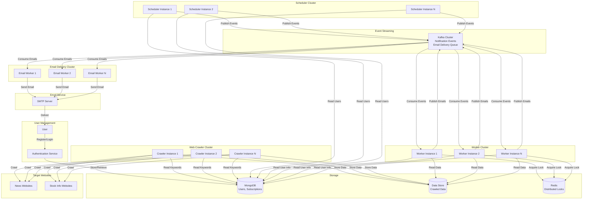
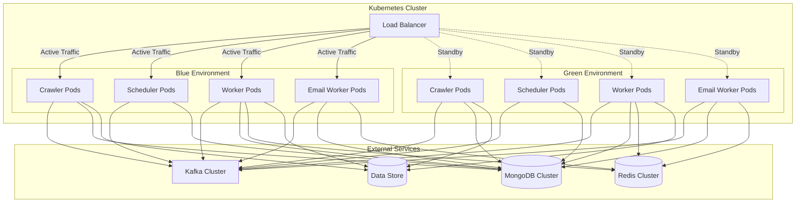

# Design Document: Alarm News System

## Overview

The Alarm News system is a distributed, event-driven email notification service that delivers personalized news and stock information based on user-defined keywords. The system uses Python-based web crawling to collect data from websites, stores user information in MongoDB, and sends email notifications at user-specified times through a Kafka message queue. The system is designed for high availability with zero-downtime deployments using blue/green strategies on Kubernetes.

### Key Design Goals

1. **Exactly-once notification delivery**: Prevent duplicate email notifications during deployments and failures
2. **Web crawling resilience**: Handle website blocks, timeouts, and failures gracefully with polite crawling
3. **Zero-downtime deployments**: Support blue/green deployment without notification loss
4. **Scalability**: Distribute workload across multiple instances using Kafka consumer groups
5. **Subscription management**: Handle 1-month subscriptions with automatic expiry and renewal
6. **Secure authentication**: Protect user accounts with bcrypt password hashing and rate limiting

### System Context

The system consists of four primary components:

- **Web Crawler**: Python-based component that crawls news and stock websites based on user keywords
- **Scheduler**: Evaluates user notification times and publishes notification events to Kafka
- **Worker**: Consumes notification events from Kafka, processes crawled data, and publishes email notifications
- **Email Delivery Worker**: Consumes email notifications from Kafka and sends emails via SMTP

External dependencies include:
- **MongoDB**: User credentials, email addresses, keywords, and subscription data storage
- **Kafka**: Event streaming platform for notification events and email delivery
- **Redis**: Distributed locking to prevent duplicate notifications during deployments
- **SMTP Server**: Email delivery service
- **Target Websites**: News and stock information websites for crawling

## Architecture

### High-Level Architecture



### Component Responsibilities

#### Authentication Service

**Primary Responsibilities:**
- Handle user registration with email validation and password generation
- Authenticate users with bcrypt password verification
- Manage subscription expiry (30-day limit)
- Handle subscription renewal and cancellation
- Rate limit authentication attempts (5 attempts per 15 minutes)
- Generate and validate authentication tokens (24-hour expiry)

**Key Design Decisions:**
- **Bcrypt hashing**: Use cost factor of 12 for password security
- **Random password generation**: 12+ characters with mixed character types
- **Token-based auth**: 24-hour JWT tokens for API access
- **Rate limiting**: Prevent brute force attacks with temporary blocks

#### Web Crawler

**Primary Responsibilities:**
- Retrieve unique keywords from MongoDB every 30 minutes
- Crawl news and stock websites based on keywords
- Extract article titles, summaries, URLs, and publication dates
- Extract stock symbols, prices, and price changes
- Store crawled data in Data Store with matched keywords
- Track crawled URLs to prevent duplicates
- Implement polite crawling (2-second delays, respect robots.txt)
- Handle website blocks and errors gracefully

**Key Design Decisions:**
- **Python implementation**: Use BeautifulSoup/Scrapy for web scraping
- **Polite crawling**: 2-second minimum delay between requests to same domain
- **Rotating user agents**: Avoid bot detection
- **robots.txt compliance**: Respect website crawling policies
- **Duplicate prevention**: Track crawled URLs in Data Store
- **Error handling**: Log errors and skip failed websites

#### Scheduler

**Primary Responsibilities:**
- Load active users with valid subscriptions from MongoDB
- Evaluate notification times with 1-minute precision
- Publish notification events to Kafka when times match
- Reload user data every 5 minutes
- Skip users with expired subscriptions
- Distribute workload using consistent hashing based on User_ID

**Key Design Decisions:**
- **Stateless design**: All state stored in MongoDB for horizontal scalability
- **Consistent hashing**: Ensures each user is evaluated by the same scheduler instance
- **Graceful degradation**: Continue with cached user data if MongoDB is temporarily unavailable
- **Subscription filtering**: Automatically exclude expired subscriptions

#### Worker

**Primary Responsibilities:**
- Consume notification events from Kafka consumer group
- Acquire distributed lock to prevent duplicate processing
- Retrieve user email and keywords from MongoDB
- Query Data Store for crawled data matching user keywords (past 24 hours)
- Format email notifications with news articles and stock information
- Publish formatted emails to Kafka email delivery topic
- Handle retries and dead letter queue for failed processing

**Key Design Decisions:**
- **Manual offset commit**: Commit Kafka offsets only after successful email publication
- **Distributed locking**: Use Redis SET NX EX for lock acquisition with 5-minute TTL
- **Graceful shutdown**: Stop consuming new messages on SIGTERM, complete in-flight notifications within 60 seconds
- **Data freshness**: Only include data from past 24 hours

#### Email Delivery Worker

**Primary Responsibilities:**
- Consume email notifications from Kafka email delivery topic
- Connect to SMTP server with TLS encryption
- Authenticate with SMTP credentials
- Send HTML-formatted emails to user addresses
- Handle retries for network timeouts and SMTP errors
- Store failed emails in dead letter queue after retry exhaustion

**Key Design Decisions:**
- **TLS encryption**: Secure email transmission
- **Retry logic**: 3 attempts with 30-second intervals
- **HTML formatting**: Support rich email content with proper MIME encoding
- **Dead letter queue**: Preserve failed emails for manual review

### Deployment Architecture



**Blue/Green Deployment Flow:**
1. Green environment starts and passes readiness probes (Kafka, MongoDB, and Redis connectivity)
2. Green workers join Kafka consumer group but initially receive no messages (blue still processing)
3. Traffic switches to green environment
4. Blue environment receives SIGTERM, stops consuming new Kafka messages
5. Blue workers complete in-flight notifications within 60-second grace period
6. Kafka rebalances, green workers take over all partitions
7. Blue environment terminates

## Components and Interfaces

### Authentication Service Component

#### User Registration Handler

**Interface:**
```python
class UserRegistrationHandler:
    def register_user(self, email: str, keywords: List[str]) -> RegistrationResult:
        """Register a new user with email and keywords"""
        pass
    
    def validate_email(self, email: str) -> bool:
        """Validate email format: [local-part]@[domain]"""
        pass
    
    def validate_keywords(self, keywords: List[str]) -> bool:
        """Validate at least 1 keyword, each 1-100 characters"""
        pass
    
    def generate_password(self) -> str:
        """Generate random 12+ char password with mixed types"""
        pass
    
    def hash_password(self, password: str) -> str:
        """Hash password using bcrypt with cost factor 12"""
        pass

@dataclass
class RegistrationResult:
    user_id: str
    password: str
    subscription_expiry: datetime
    success: bool
    error_message: Optional[str] = None
```

**Responsibilities:**
- Validate email address format (non-empty local-part and domain)
- Validate keywords (at least 1, each 1-100 characters, max 20 keywords)
- Generate unique User_ID
- Generate secure random password (12+ chars, mixed types)
- Hash password with bcrypt (cost factor 12)
- Set subscription expiry to 30 days from registration
- Store user data in MongoDB
- Send welcome email with credentials and expiry date

**Implementation Notes:**
- Use regex for email validation: `^[^@]+@[^@]+$`
- Use `secrets` module for cryptographically secure password generation
- Use `bcrypt` library with cost factor 12
- Generate User_ID using UUID4
- Handle MongoDB write failures with error messages

#### Authentication Handler

**Interface:**
```python
class AuthenticationHandler:
    def authenticate(self, user_id: str, password: str) -> AuthResult:
        """Authenticate user with credentials"""
        pass
    
    def verify_password(self, password: str, hashed: str) -> bool:
        """Verify password against bcrypt hash"""
        pass
    
    def check_subscription_valid(self, expiry: datetime) -> bool:
        """Check if subscription has not expired"""
        pass
    
    def generate_token(self, user_id: str) -> str:
        """Generate 24-hour authentication token"""
        pass
    
    def rate_limit_check(self, user_id: str) -> bool:
        """Check if user exceeded 5 attempts in 15 minutes"""
        pass

@dataclass
class AuthResult:
    token: Optional[str]
    success: bool
    error_message: Optional[str] = None
```

**Responsibilities:**
- Retrieve user record from MongoDB by User_ID
- Verify password using bcrypt
- Check subscription expiry against current timestamp
- Generate JWT token with 24-hour expiry
- Rate limit authentication attempts (5 per 15 minutes)
- Temporarily block User_ID for 15 minutes after limit exceeded

**Implementation Notes:**
- Use `bcrypt.checkpw()` for password verification
- Use JWT with HS256 algorithm for tokens
- Store rate limit data in Redis with sliding window
- Return generic "invalid credentials" error for security

#### Subscription Manager

**Interface:**
```python
class SubscriptionManager:
    def renew_subscription(self, user_id: str) -> RenewalResult:
        """Renew user subscription for 30 days"""
        pass
    
    def cancel_subscription(self, user_id: str) -> CancellationResult:
        """Cancel subscription and delete user data"""
        pass
    
    def calculate_new_expiry(self, current_expiry: datetime) -> datetime:
        """Calculate new expiry: 30 days from current or now"""
        pass
    
    def invalidate_tokens(self, user_id: str) -> None:
        """Invalidate all tokens for user"""
        pass

@dataclass
class RenewalResult:
    new_expiry: datetime
    success: bool
    error_message: Optional[str] = None

@dataclass
class CancellationResult:
    success: bool
    error_message: Optional[str] = None
```

**Responsibilities:**
- Renew subscription: add 30 days to current expiry (or from now if expired)
- Allow renewal up to 7 days before expiry
- Cancel subscription: delete user record from MongoDB
- Invalidate all authentication tokens on cancellation
- Send confirmation emails for renewal and cancellation

**Implementation Notes:**
- Calculate new expiry: `max(current_expiry, now) + timedelta(days=30)`
- Delete user document from MongoDB on cancellation
- Store invalidated tokens in Redis with TTL
- Handle MongoDB operation failures with error messages

### Web Crawler Component

#### Keyword Retriever

**Interface:**
```python
class KeywordRetriever:
    def get_unique_keywords(self) -> List[str]:
        """Retrieve all unique keywords from MongoDB"""
        pass
    
    def create_crawler_jobs(self, keywords: List[str]) -> List[CrawlerJob]:
        """Create crawler jobs for each keyword"""
        pass

@dataclass
class CrawlerJob:
    keyword: str
    target_sites: List[str]
    job_id: str
```

**Responsibilities:**
- Query MongoDB for all active users (subscription not expired)
- Extract and deduplicate keywords from all users
- Create crawler jobs for each unique keyword
- Run every 30 minutes

**Implementation Notes:**
- Use MongoDB aggregation to get distinct keywords
- Filter users by `subscription_expiry > current_timestamp`
- Generate job_id using UUID4

#### News Crawler

**Interface:**
```python
class NewsCrawler:
    def crawl_news(self, keyword: str, sites: List[str]) -> List[NewsArticle]:
        """Crawl news websites for keyword matches"""
        pass
    
    def extract_article(self, html: str, url: str) -> Optional[NewsArticle]:
        """Extract article details from HTML"""
        pass
    
    def is_duplicate(self, url: str) -> bool:
        """Check if article URL already crawled"""
        pass
    
    def respect_robots_txt(self, domain: str) -> bool:
        """Check if crawling allowed by robots.txt"""
        pass

@dataclass
class NewsArticle:
    article_id: str
    title: str
    summary: str  # Up to 500 characters
    url: str
    published_date: datetime
    source: str
    matched_keyword: str
    crawl_timestamp: datetime
```

**Responsibilities:**
- Crawl configured news websites for articles
- Match articles using case-insensitive substring in title/content
- Extract title, summary (500 chars), URL, publication date, source
- Store crawled data in Data Store with matched keyword
- Track crawled URLs to prevent duplicates
- Implement polite crawling (2-second delays)
- Respect robots.txt directives
- Use rotating user agents
- Timeout requests after 30 seconds

**Implementation Notes:**
- Use BeautifulSoup or Scrapy for HTML parsing
- Use `urllib.robotparser` for robots.txt compliance
- Store crawled URLs in Data Store with TTL
- Log errors for blocked/failed websites (4xx, 5xx)
- Implement request delays using `time.sleep(2)`

#### Stock Crawler

**Interface:**
```python
class StockCrawler:
    def crawl_stocks(self, keyword: str, sites: List[str]) -> List[StockData]:
        """Crawl stock websites for keyword matches"""
        pass
    
    def extract_stock_data(self, html: str) -> Optional[StockData]:
        """Extract stock details from HTML"""
        pass
    
    def calculate_price_change(self, current: float, previous: float) -> float:
        """Calculate percentage change: ((current - previous) / previous) * 100"""
        pass
    
    def validate_price(self, price: float) -> bool:
        """Validate price is positive number"""
        pass

@dataclass
class StockData:
    stock_id: str
    symbol: str
    company_name: str
    current_price: float
    price_change: float
    percentage_change: float  # Rounded to 2 decimals
    last_update: datetime
    matched_keyword: str
    crawl_timestamp: datetime
```

**Responsibilities:**
- Crawl stock information websites
- Match stocks using case-insensitive substring in symbol/company name
- Extract symbol, company name, price, price change, percentage change
- Store stock data in Data Store with matched keyword
- Crawl every 15 minutes during market hours
- Validate prices are positive numbers
- Track previous prices to calculate changes
- Format percentage changes to 2 decimal places

**Implementation Notes:**
- Use BeautifulSoup for HTML parsing
- Store previous prices in Data Store
- Calculate percentage: `((current - previous) / previous) * 100`
- Round to 2 decimals using `round(value, 2)`
- Log errors for invalid price data

### Scheduler Component

#### User Loader

**Interface:**
```python
class UserLoader:
    def load_active_users(self) -> List[UserNotificationConfig]:
        """Load all users with valid subscriptions"""
        pass
    
    def reload_users(self) -> None:
        """Reload user data every 5 minutes"""
        pass
    
    def filter_expired_subscriptions(self, users: List[User]) -> List[User]:
        """Filter out users with expired subscriptions"""
        pass

@dataclass
class UserNotificationConfig:
    user_id: str
    email: str
    keywords: List[str]
    notification_times: List[NotificationTime]
    subscription_expiry: datetime

@dataclass
class NotificationTime:
    hour: int  # 0-23
    minute: int  # 0-59
```

**Responsibilities:**
- Load all active users from MongoDB on startup
- Retry MongoDB connection every 10 seconds (max 10 attempts) on startup failure
- Reload user data every 5 minutes
- Filter users where `subscription_expiry > current_timestamp`
- Continue with cached data if MongoDB unavailable during reload

**Implementation Notes:**
- Query MongoDB: `db.users.find({"subscription_expiry": {"$gt": datetime.now()}})`
- Cache users in memory between reloads
- Log warnings on MongoDB reload failures

#### Notification Time Evaluator

**Interface:**
```python
class NotificationTimeEvaluator:
    def evaluate_notification_times(self, current_time: datetime) -> List[NotificationEvent]:
        """Evaluate which users should receive notifications"""
        pass
    
    def matches_notification_time(self, current: datetime, target: NotificationTime) -> bool:
        """Check if current time matches target (1-minute precision)"""
        pass
    
    def distribute_by_user_id(self, user_id: str) -> int:
        """Consistent hashing to distribute users across instances"""
        pass

@dataclass
class NotificationEvent:
    event_id: str  # UUID for idempotency
    user_id: str
    notification_timestamp: datetime
```

**Responsibilities:**
- Evaluate notification times with 1-minute precision
- Match current time (hour, minute) against user notification times
- Publish notification events to Kafka within 10 seconds of match
- Distribute users across scheduler instances using consistent hashing
- Skip users with expired subscriptions

**Implementation Notes:**
- Compare times: `current.hour == target.hour and current.minute == target.minute`
- Use consistent hashing based on User_ID
- Generate event_id using UUID4 for idempotency

#### Event Publisher

**Interface:**
```python
class EventPublisher:
    def publish_event(self, event: NotificationEvent) -> None:
        """Publish notification event to Kafka"""
        pass
    
    def retry_publish(self, event: NotificationEvent, attempts: int = 3) -> bool:
        """Retry failed publishes with 5-second intervals"""
        pass

```

**Responsibilities:**
- Publish notification events to Kafka with acks=all
- Retry failed publishes up to 3 times with 5-second intervals
- Log and discard events after retry exhaustion

**Implementation Notes:**
- Use Kafka producer with `acks='all'` and `enable_idempotence=True`
- Partition by user_id for ordered processing
- Set request timeout to 30 seconds
- Log errors after retry exhaustion

### Worker Component

#### Event Consumer

**Interface:**
```python
class EventConsumer:
    def consume_events(self, handler: Callable[[NotificationEvent], None]) -> None:
        """Consume events from Kafka consumer group"""
        pass
    
    def shutdown(self) -> None:
        """Graceful shutdown: stop consuming, complete in-flight"""
        pass
    
    def commit_offset(self, event: NotificationEvent) -> None:
        """Manually commit offset after successful processing"""
        pass
```

**Responsibilities:**
- Consume events from Kafka consumer group
- Use manual offset commit mode
- Handle graceful shutdown on SIGTERM
- Stop consuming new messages on shutdown signal
- Complete in-flight notifications within 60 seconds

**Implementation Notes:**
- Set `enable_auto_commit=False` for manual commits
- Set `session_timeout_ms=30000` for fast rebalancing
- Set `max_poll_interval_ms=300000` (5 minutes) for processing time
- Commit offsets only after email published to Kafka

#### Distributed Lock Manager

**Interface:**
```python
class DistributedLockManager:
    def acquire_lock(self, event_id: str, ttl: int = 300) -> bool:
        """Acquire distributed lock using Redis SET NX EX"""
        pass
    
    def release_lock(self, event_id: str, worker_id: str) -> None:
        """Release lock atomically (check and delete)"""
        pass
    
    def is_lock_held(self, event_id: str) -> bool:
        """Check if lock already held by another worker"""
        pass
```

**Responsibilities:**
- Acquire distributed lock using Redis SET NX EX
- Prevent duplicate processing during blue/green deployments
- Release lock after processing or on failure
- Handle lock acquisition timeouts (10 seconds)
- Set lock TTL to 5 minutes to prevent deadlocks

**Implementation Notes:**
- Lock key format: `lock:event:{event_id}`
- Lock value: worker_id for ownership tracking
- Use Lua script for atomic release (check owner and delete)
- Return False if lock already held (skip processing)
- Do not acknowledge Kafka message if lock acquisition times out

**Redis Lock Pattern:**
```python
# Acquire lock
redis.set(f"lock:event:{event_id}", worker_id, nx=True, ex=300)

# Release lock (Lua script for atomicity)
release_script = """
if redis.call("GET", KEYS[1]) == ARGV[1] then
    return redis.call("DEL", KEYS[1])
else
    return 0
end
"""
```

#### Data Retriever

**Interface:**
```python
class DataRetriever:
    def get_user_info(self, user_id: str) -> Optional[UserInfo]:
        """Retrieve user email and keywords from MongoDB"""
        pass
    
    def get_crawled_data(self, keywords: List[str], hours: int = 24) -> CrawledData:
        """Query Data Store for crawled data matching keywords"""
        pass
    
    def filter_by_timeframe(self, data: List, hours: int) -> List:
        """Filter data to past N hours"""
        pass

@dataclass
class UserInfo:
    user_id: str
    email: str
    keywords: List[str]
    subscription_expiry: datetime

@dataclass
class CrawledData:
    news_articles: List[NewsArticle]
    stock_data: List[StockData]
```

**Responsibilities:**
- Retrieve user email and keywords from MongoDB
- Skip processing if user not found or subscription expired
- Query Data Store for crawled data matching user keywords
- Filter data to past 24 hours
- Group data into news articles and stock information

**Implementation Notes:**
- Query MongoDB by user_id
- Check subscription_expiry before processing
- Query Data Store with keyword filter and timestamp range
- Sort by crawl_timestamp descending

#### Email Formatter

**Interface:**
```python
class EmailFormatter:
    def format_email(self, user_info: UserInfo, data: CrawledData) -> EmailNotification:
        """Format email notification with news and stock data"""
        pass
    
    def create_subject(self, date: datetime, keywords: List[str]) -> str:
        """Create subject line with date and keywords"""
        pass
    
    def create_body(self, news: List[NewsArticle], stocks: List[StockData]) -> str:
        """Create HTML email body with sections"""
        pass
    
    def limit_items(self, items: List, max_count: int = 10) -> List:
        """Limit to max items, select most recent"""
        pass

@dataclass
class EmailNotification:
    to_email: str
    subject: str
    body_html: str
    timestamp: datetime
```

**Responsibilities:**
- Format email with subject line containing date and keywords
- Create HTML body with greeting, news section, stock section, footer
- Include article title, summary, URL for each news item
- Include symbol, company name, price, percentage change for each stock
- Limit to 10 news articles and 10 stock items (most recent)
- Include unsubscribe instructions in footer
- Add timestamp in ISO 8601 format

**Implementation Notes:**
- Subject format: `Alarm News - {date} - {keywords}`
- Use HTML templates for email body
- Select most recent items by crawl_timestamp
- Format prices to 2 decimal places
- Format percentage changes with + or - sign
- Include ISO 8601 timestamp: `datetime.now().isoformat()`

#### Email Publisher

**Interface:**
```python
class EmailPublisher:
    def publish_email(self, email: EmailNotification) -> None:
        """Publish formatted email to Kafka email delivery topic"""
        pass
    
    def retry_publish(self, email: EmailNotification, attempts: int = 3) -> bool:
        """Retry failed publishes with 5-second intervals"""
        pass
    
    def send_to_dlq(self, email: EmailNotification, reason: str) -> None:
        """Send failed email to dead letter queue"""
        pass
```

**Responsibilities:**
- Publish formatted email to Kafka email delivery topic within 10 seconds
- Retry failed publishes up to 3 times with 5-second intervals
- Store failed emails in dead letter queue after retry exhaustion
- Log failures with correlation IDs

**Implementation Notes:**
- Use Kafka producer with `acks='all'`
- Partition by user_id for ordered delivery
- Dead letter queue: Kafka topic `notification-dlq`
- Include failure reason and attempt count in DLQ messages

### Email Delivery Worker Component

#### Email Consumer

**Interface:**
```python
class EmailConsumer:
    def consume_emails(self, handler: Callable[[EmailNotification], None]) -> None:
        """Consume email notifications from Kafka"""
        pass
    
    def commit_offset(self, email: EmailNotification) -> None:
        """Manually commit offset after successful delivery"""
        pass
```

**Responsibilities:**
- Consume email notifications from Kafka email delivery topic
- Use manual offset commit mode
- Commit offsets only after successful email delivery or DLQ storage

**Implementation Notes:**
- Set `enable_auto_commit=False`
- Commit after SMTP success or DLQ storage

#### SMTP Client

**Interface:**
```python
class SMTPClient:
    def connect(self, host: str, port: int) -> bool:
        """Connect to SMTP server with TLS encryption"""
        pass
    
    def authenticate(self, username: str, password: str) -> bool:
        """Authenticate with SMTP credentials"""
        pass
    
    def send_email(self, email: EmailNotification) -> bool:
        """Send HTML-formatted email"""
        pass
    
    def retry_send(self, email: EmailNotification, attempts: int = 3) -> bool:
        """Retry failed sends with 30-second intervals"""
        pass

```

**Responsibilities:**
- Connect to SMTP server with TLS encryption
- Retry connection up to 3 times with 30-second intervals on failure
- Authenticate with configured SMTP credentials
- Send HTML-formatted emails with proper MIME encoding
- Retry email delivery up to 3 times with 30-second intervals
- Store failed emails in dead letter queue after retry exhaustion

**Implementation Notes:**
- Use `smtplib.SMTP_SSL` or `SMTP` with `starttls()`
- Set connection timeout to 10 seconds
- Retry on network timeouts and 5xx SMTP errors
- Do not retry on 4xx errors (except 429)
- Use `email.mime` for HTML formatting
- Log SMTP errors with correlation IDs

## Data Models

### User Data (MongoDB)

**Database:** `alarm_news`
**Collection:** `users`

**Document Structure:**
```json
{
  "_id": "ObjectId",
  "user_id": "user-uuid-123",
  "hashed_password": "$2b$12$...",
  "email": "user@example.com",
  "keywords": ["technology", "AI", "AAPL", "earnings"],
  "notification_times": [
    {"hour": 9, "minute": 0},
    {"hour": 17, "minute": 30}
  ],
  "subscription_expiry": "ISODate('2025-02-15T14:30:00Z')",
  "created_at": "ISODate('2025-01-15T14:30:00Z')",
  "updated_at": "ISODate('2025-01-15T14:30:00Z')"
}
```

**Indexes:**
- Unique index on `user_id`
- Index on `subscription_expiry` for efficient expiry queries
- Index on `keywords` for crawler keyword retrieval

**Constraints:**
- `user_id`: String, unique, required
- `hashed_password`: String, bcrypt hash, required
- `email`: String, email format, required
- `keywords`: Array of strings, 1-20 items, each 1-100 characters
- `notification_times`: Array of objects, 0-5 items, hour (0-23), minute (0-59)
- `subscription_expiry`: DateTime, required

### Crawled News Data (Data Store)

**Collection/Table:** `crawled_news`

**Document Structure:**
```json
{
  "article_id": "art-uuid-789",
  "title": "Breaking: New AI Technology Announced",
  "summary": "A major tech company announced...",
  "url": "https://news.example.com/article/123",
  "published_date": "2025-01-15T10:30:00Z",
  "source": "TechNews",
  "matched_keyword": "AI",
  "crawl_timestamp": "2025-01-15T14:30:00Z",
  "crawled_url_hash": "sha256-hash-of-url"
}
```

**Indexes:**
- Index on `matched_keyword` for efficient keyword queries
- Index on `crawl_timestamp` for time-based filtering
- Unique index on `crawled_url_hash` to prevent duplicates

### Crawled Stock Data (Data Store)

**Collection/Table:** `crawled_stocks`

**Document Structure:**
```json
{
  "stock_id": "stock-uuid-456",
  "symbol": "AAPL",
  "company_name": "Apple Inc.",
  "current_price": 150.25,
  "previous_price": 149.50,
  "price_change": 0.75,
  "percentage_change": 0.50,
  "last_update": "2025-01-15T14:30:00Z",
  "matched_keyword": "AAPL",
  "crawl_timestamp": "2025-01-15T14:30:00Z"
}
```

**Indexes:**
- Index on `matched_keyword` for efficient keyword queries
- Index on `crawl_timestamp` for time-based filtering
- Index on `symbol` for previous price lookups

### Distributed Lock (Redis)

**Key Pattern:** `lock:event:{event_id}`

**Data Structure:** STRING
```
Key: lock:event:evt-uuid-123
Value: worker-pod-abc123 (worker_id)
TTL: 300 seconds (5 minutes)
```

**Operations:**
- Acquire: `SET lock:event:{event_id} {worker_id} NX EX 300`
- Release: Lua script (atomic check and delete)
- Check: `GET lock:event:{event_id}`

### Authentication Rate Limiting (Redis)

**Key Pattern:** `ratelimit:auth:{user_id}`

**Data Structure:** ZSET with timestamp scores
```
Key: ratelimit:auth:user-uuid-123
Members: timestamp values (e.g., "1705329000123")
Scores: same timestamp values
TTL: 900 seconds (15 minutes)
```

**Operations:**
- Track attempt: `ZADD ratelimit:auth:{user_id} {timestamp} {timestamp}`
- Remove old: `ZREMRANGEBYSCORE ratelimit:auth:{user_id} 0 {timestamp - 900}`
- Count attempts: `ZCARD ratelimit:auth:{user_id}`
- Block if count >= 5

### Invalidated Tokens (Redis)

**Key Pattern:** `token:invalid:{token_hash}`

**Data Structure:** STRING
```
Key: token:invalid:sha256-hash-of-token
Value: user_id
TTL: 86400 seconds (24 hours)
```

**Purpose:** Track invalidated tokens after subscription cancellation

### Kafka Topics

#### Notification Events Topic

**Topic Name:** `notification-events`

**Configuration:**
- Partitions: 12 (for parallelism)
- Replication Factor: 3
- min.insync.replicas: 2
- retention.ms: 86400000 (24 hours)

**Message Schema:**
```json
{
  "event_id": "evt-uuid-123",
  "user_id": "user-uuid-456",
  "notification_timestamp": "2025-01-15T14:35:00Z",
  "created_at": "2025-01-15T14:35:05Z"
}
```

**Partitioning:** By `user_id` for ordered processing per user

#### Email Delivery Topic

**Topic Name:** `email-delivery`

**Configuration:**
- Partitions: 12
- Replication Factor: 3
- min.insync.replicas: 2
- retention.ms: 86400000 (24 hours)

**Message Schema:**
```json
{
  "email_id": "email-uuid-789",
  "to_email": "user@example.com",
  "subject": "Alarm News - 2025-01-15 - AI, AAPL",
  "body_html": "<html>...</html>",
  "timestamp": "2025-01-15T14:35:10Z",
  "user_id": "user-uuid-456"
}
```

**Partitioning:** By `user_id` for ordered delivery per user

#### Dead Letter Queue Topic

**Topic Name:** `notification-dlq`

**Configuration:**
- Partitions: 3
- Replication Factor: 3
- retention.ms: 604800000 (7 days)

**Message Schema:**
```json
{
  "original_event": {
    "event_id": "evt-uuid-123",
    "user_id": "user-uuid-456"
  },
  "failure_reason": "SMTP connection timeout",
  "failure_type": "email_delivery",
  "attempt_count": 3,
  "last_attempt_at": "2025-01-15T14:40:00Z",
  "failed_at": "2025-01-15T14:42:00Z",
  "correlation_id": "corr-uuid-999"
}
```


## Correctness Properties

### Property 0: Not Applicable

**Property-based testing is not applicable to this infrastructure orchestration system.**

*For any* component in this system, traditional property-based testing cannot be applied because the system consists of infrastructure orchestration with side effects rather than pure functions with testable input/output relationships.

**Validates: Requirements 0.0**

### Rationale: Why Property-Based Testing Is Not Applicable

This system is primarily an infrastructure orchestration platform with side effects, making traditional property-based testing unsuitable. Property-based testing works best for pure functions with clear input/output behavior where universal properties can be verified across many generated inputs.

**Reasons PBT Does Not Apply:**

1. **Infrastructure as Code**: The system deploys and manages Kubernetes resources, Kafka topics, and Redis data structures. These are declarative configurations, not functions with testable input/output relationships.

2. **Side-Effect-Only Operations**: Core operations include:
   - Publishing events to Kafka
   - Acquiring distributed locks in Redis
   - Sending notifications to external webhooks (Slack, Discord, KakaoTalk)
   - Polling external APIs with rate limits
   
   These operations have no return values to assert universal properties on, and their correctness depends on external system state.

3. **External Service Dependencies**: The system integrates with multiple external services (news APIs, stock APIs, notification channels) whose behavior is non-deterministic and cannot be meaningfully tested with generated inputs.

4. **Stateful Distributed System**: Correctness depends on distributed coordination (Kafka consumer groups, Redis locks, blue/green deployments) rather than mathematical properties that hold across all inputs.

**Alternative Testing Strategies:**

Instead of property-based testing, this system uses:

- **Integration Tests**: Verify Kafka, Redis, and external API interactions using Testcontainers and mocks
- **Contract Tests**: Validate external API request/response formats
- **Chaos Tests**: Verify resilience to infrastructure failures (Redis down, Kafka broker failure, pod termination)
- **End-to-End Tests**: Validate complete user workflows in staging environment
- **Load Tests**: Verify system handles expected scale (10,000 users, 100,000 conditions)
- **Deployment Tests**: Verify zero-downtime blue/green deployments with no notification loss or duplicates

These testing strategies are more appropriate for validating the correctness of a distributed, event-driven system with external dependencies and side effects.

## Error Handling

### Web Crawling Failures

**Failure Scenarios:**
1. **Website Timeout**: Website does not respond within 30 seconds
2. **Website Block**: Website returns HTTP 403 or blocks crawler
3. **Server Error**: Website returns 5xx status code
4. **Client Error**: Website returns 4xx status code
5. **Network Error**: Connection refused, DNS failure, etc.
6. **robots.txt Disallowed**: Website robots.txt blocks crawling
7. **Invalid Data**: Extracted data fails validation (e.g., negative stock price)

**Handling Strategy:**

| Scenario | Crawler Behavior |
|----------|------------------|
| Timeout (30s) | Log error, skip website for current crawl cycle |
| Website Block (403) | Log error, skip website for current crawl cycle |
| Server Error (5xx) | Log error, skip website for current crawl cycle |
| Client Error (4xx) | Log error, skip website for current crawl cycle |
| Network Error | Log error, skip website for current crawl cycle |
| robots.txt Disallowed | Skip website, respect robots.txt |
| Invalid Data | Log error, skip article/stock for current crawl cycle |

**Polite Crawling Implementation:**
- Minimum 2-second delay between requests to same domain
- Respect robots.txt directives using `urllib.robotparser`
- Use rotating user agents to avoid detection
- Track failed domains and reduce crawl frequency

### MongoDB Failures

**Failure Scenarios:**
1. **Connection Failure**: MongoDB is unreachable
2. **Timeout**: MongoDB operation exceeds timeout
3. **Write Failure**: Document write operation fails
4. **Read Failure**: Document read operation fails

**Handling Strategy:**

**Authentication Service:**
- On registration write failure: Return error to user, do not send welcome email
- On authentication read failure: Return error to user
- On subscription update failure: Return error to user

**Web Crawler:**
- On keyword retrieval failure: Log error, use previously retrieved keywords
- Retry connection every 30 seconds for up to 10 attempts

**Scheduler:**
- On startup: Retry connection every 10 seconds for up to 10 attempts, then fail
- During reload: Log warning, continue with previously loaded user data
- On user read failure: Continue with cached data

**Worker:**
- On user info read failure: Skip processing, acknowledge Kafka message
- Retry read up to 3 times with 5-second intervals before skipping

### Redis Failures

**Failure Scenarios:**
1. **Connection Failure**: Redis is unreachable
2. **Timeout**: Redis operation exceeds timeout
3. **Lock Acquisition Failure**: Cannot acquire distributed lock

**Handling Strategy:**

**Worker:**
- On lock acquisition timeout (10 seconds): Do not acknowledge Kafka message, allow redelivery
- On lock already held: Skip processing, acknowledge Kafka message (another worker is processing)
- On Redis connection failure: Skip lock acquisition (risk of duplicates), continue processing

**Authentication Service:**
- On rate limit tracking failure: Log warning, allow authentication (fail open)
- On token invalidation failure: Log error, continue (tokens expire after 24 hours)

### Kafka Failures

**Failure Scenarios:**
1. **Publish Failure**: Cannot publish event to Kafka
2. **Consumer Lag**: Worker cannot keep up with event rate
3. **Rebalancing**: Consumer group rebalancing during deployment

**Handling Strategy:**

**Scheduler:**
- Retry publish up to 3 times with 5-second intervals
- After retry exhaustion: Log error and discard event (user will be notified at next scheduled time)

**Worker:**
- On consumer lag: Scale horizontally by adding more worker instances
- During rebalancing: Kafka automatically reassigns partitions within 30 seconds
- On processing failure: Do not commit offset, allow redelivery after rebalancing

**Email Delivery Worker:**
- On consumer lag: Scale horizontally by adding more email worker instances
- On processing failure: Do not commit offset, allow redelivery

### SMTP Failures

**Failure Scenarios:**
1. **Connection Timeout**: SMTP server does not respond within 10 seconds
2. **Authentication Failure**: Invalid SMTP credentials
3. **Server Error**: SMTP server returns 5xx error
4. **Client Error**: SMTP server returns 4xx error
5. **Network Error**: Connection refused, DNS failure

**Handling Strategy:**

| Scenario | Retry Strategy | Final Action |
|----------|---------------|--------------|
| Connection Timeout | 3 retries with 30-second intervals | Send to dead letter queue |
| Auth Failure (4xx) | No retry | Send to dead letter queue, alert operators |
| Server Error (5xx) | 3 retries with 30-second intervals | Send to dead letter queue |
| Client Error (4xx) | No retry | Send to dead letter queue |
| Network Error | 3 retries with 30-second intervals | Send to dead letter queue |

**Dead Letter Queue Processing:**
- Store failed emails in Kafka topic `notification-dlq`
- Include original email, failure reason, attempt count, and timestamps
- Retention: 7 days for manual review and reprocessing
- Alert operators for manual intervention

### Data Store Failures

**Failure Scenarios:**
1. **Connection Failure**: Data Store is unreachable
2. **Write Failure**: Cannot store crawled data
3. **Read Failure**: Cannot retrieve crawled data

**Handling Strategy:**

**Web Crawler:**
- On write failure: Retry up to 3 times with 5-second intervals
- After retry exhaustion: Log error, discard crawled data (will be re-crawled in next cycle)

**Worker:**
- On read failure: Retry up to 3 times with 5-second intervals
- After retry exhaustion: Send notification with no data (empty email), or skip and acknowledge Kafka message

### Graceful Degradation

**Scenarios:**

1. **MongoDB Down:**
   - Authentication Service: Return errors to users
   - Web Crawler: Use previously retrieved keywords
   - Scheduler: Continue with last loaded user data
   - Worker: Skip processing, acknowledge Kafka messages

2. **Redis Down:**
   - Worker: Skip lock acquisition (risk of duplicates), continue processing
   - Authentication Service: Allow authentication without rate limiting (fail open)

3. **Kafka Down:**
   - Scheduler: Buffer events in memory (max 1000), retry publish
   - Worker: Cannot consume, wait for Kafka recovery
   - Email Delivery Worker: Cannot consume, wait for Kafka recovery

4. **Data Store Down:**
   - Web Crawler: Cannot store data, wait for recovery
   - Worker: Send empty notifications or skip processing

5. **SMTP Down:**
   - Email Delivery Worker: Retry with exponential backoff, send to DLQ after exhaustion

**Priority:** Prefer notification loss over duplicate notifications in extreme failure scenarios.

## Testing Strategy

### Unit Testing

**Authentication Service:**
- Email validation logic (valid/invalid formats)
- Password generation (length, character types)
- Password hashing with bcrypt (cost factor 12)
- Subscription expiry calculation (30 days from registration/renewal)
- Rate limiting logic (5 attempts in 15 minutes)
- Token generation and validation (24-hour expiry)

**Web Crawler:**
- Keyword matching algorithm (case-insensitive substring)
- Article summary truncation (500 characters)
- Stock price validation (positive numbers)
- Percentage change calculation (2 decimal places)
- URL duplicate detection (hash-based)
- robots.txt parsing and compliance

**Scheduler:**
- Notification time matching (1-minute precision)
- Subscription expiry filtering
- Consistent hashing distribution
- Event ID generation for idempotency

**Worker:**
- Email formatting (subject line, HTML body)
- Data filtering (past 24 hours)
- Item limiting (10 news, 10 stocks, most recent)
- Lock acquisition/release logic
- Timestamp formatting (ISO 8601)

**Email Delivery Worker:**
- SMTP connection with TLS
- HTML email formatting with MIME encoding
- Retry logic with 30-second intervals

**Test Framework:** pytest (Python)

**Coverage Target:** 80% line coverage for business logic

### Integration Testing

**MongoDB Integration:**
- User CRUD operations (create, read, update, delete)
- Keyword retrieval with aggregation
- Subscription expiry queries
- Index usage verification
- Connection pooling behavior

**Kafka Integration:**
- Publish and consume events end-to-end
- Consumer group rebalancing behavior
- Manual offset commit after successful processing
- Dead letter queue message routing
- Partition assignment by user_id

**Redis Integration:**
- Distributed lock acquisition and release
- Lock TTL expiration (5 minutes)
- Rate limit tracking with sliding window (ZSET)
- Token invalidation storage

**Data Store Integration:**
- Crawled data write operations
- Keyword-based queries
- Time-based filtering (past 24 hours)
- Duplicate URL prevention

**SMTP Integration:**
- Mock SMTP server for email delivery
- TLS connection establishment
- Authentication with credentials
- HTML email sending with MIME encoding
- Retry logic on failures

**Test Framework:** Testcontainers for MongoDB, Kafka, Redis; pytest for Python

**Test Scenarios:**
1. End-to-end notification flow (user registration → crawler → scheduler → worker → email delivery)
2. Duplicate prevention with distributed locks during blue/green deployment
3. Subscription expiry filtering in scheduler
4. Rate limiting blocks authentication after 5 attempts
5. Failed email delivery goes to dead letter queue

### Load Testing

**Objectives:**
- Verify system handles expected load (10,000 users, 200,000 keywords)
- Identify bottlenecks in crawler, scheduler, worker, and email delivery components
- Validate Kafka throughput and consumer lag
- Validate MongoDB and Redis performance under load

**Test Scenarios:**
1. **Crawler Load:**
   - 200,000 unique keywords
   - 100 target websites
   - Measure: Crawl latency, articles collected per cycle, duplicate prevention rate

2. **Scheduler Load:**
   - 10,000 users with 5 notification times each
   - Measure: Event publish rate, MongoDB query latency, Kafka publish latency

3. **Worker Load:**
   - 1,000 events/second consumption rate
   - Measure: Processing latency, email publish rate, lock acquisition success rate

4. **Email Delivery Load:**
   - 1,000 emails/second consumption rate
   - Measure: SMTP connection latency, email delivery success rate, retry rate

5. **Blue/Green Deployment:**
   - Simulate deployment during peak load
   - Measure: Notification loss (should be 0), duplicate rate (should be <1%)

**Tools:** Locust or k6 for load generation, Prometheus for metrics collection

### Chaos Testing

**Objectives:**
- Verify system resilience to infrastructure failures
- Validate graceful degradation behavior
- Ensure no notification loss during failures

**Test Scenarios:**
1. **MongoDB Failure:**
   - Kill MongoDB during crawler keyword retrieval
   - Verify: Crawler continues with previously retrieved keywords

2. **Redis Failure:**
   - Kill Redis during worker processing
   - Verify: Worker skips locks (risk of duplicates acceptable), continues processing

3. **Kafka Failure:**
   - Kill Kafka broker during event publishing
   - Verify: Scheduler retries, events not lost

4. **Data Store Failure:**
   - Kill Data Store during crawler write
   - Verify: Crawler retries, data not lost

5. **SMTP Failure:**
   - Simulate SMTP timeout during email delivery
   - Verify: Email worker retries, sends to DLQ after exhaustion

6. **Worker Pod Termination:**
   - Kill worker pod during notification processing
   - Verify: Kafka rebalances, event redelivered, no notification loss

**Tools:** Chaos Mesh or Litmus for Kubernetes chaos engineering

### End-to-End Testing

**Objectives:**
- Verify complete user workflows
- Validate blue/green deployment without notification loss or duplicates

**Test Scenarios:**
1. **User Registration → Keyword Crawling → Notification Delivery:**
   - User registers with email and keywords
   - Crawler collects matching articles and stocks
   - Scheduler triggers notification at specified time
   - Worker formats email with crawled data
   - Email delivery worker sends email via SMTP
   - User receives email in inbox

2. **Subscription Renewal:**
   - User renews subscription before expiry
   - Subscription expiry extended by 30 days
   - User continues receiving notifications

3. **Subscription Cancellation:**
   - User cancels subscription
   - User data deleted from MongoDB
   - Tokens invalidated
   - User stops receiving notifications

4. **Blue/Green Deployment:**
   - Deploy green environment during active notifications
   - Verify: No notification loss, no duplicates, all emails delivered

**Environment:** Staging environment with real MongoDB, Kafka, Redis, Data Store, and mock SMTP server

**Validation:**
- Email delivered within 60 seconds of notification time
- No duplicate emails during deployment
- All notifications accounted for (published events = delivered + DLQ)

### Monitoring and Observability Testing

**Objectives:**
- Verify health check endpoints return correct status
- Validate metrics are emitted correctly
- Ensure logs contain correlation IDs for tracing

**Test Scenarios:**
1. **Health Check:**
   - Kafka, MongoDB, and Redis healthy → HTTP 200
   - Kafka down → HTTP 503 with dependency identification
   - MongoDB down → HTTP 503 with dependency identification
   - Redis down → HTTP 503 with dependency identification

2. **Metrics:**
   - Notification processing latency (p50, p95, p99)
   - Crawl success rate (percentage 0-100)
   - Email delivery success rate (percentage 0-100)
   - Worker has not processed notification for 5+ minutes → unhealthy

3. **Logging:**
   - All notification events include correlation ID (event_id)
   - Failed notifications logged with failure reason
   - Crawler errors logged with website URL and error type
   - SMTP errors logged with correlation ID

**Tools:** Prometheus for metrics, ELK stack for logs, Jaeger for distributed tracing

### Property-Based Testing

**Not Applicable:** This system is primarily infrastructure orchestration with side effects (web crawling, MongoDB, Kafka, Redis, SMTP). Property-based testing is not suitable for:
- Infrastructure as Code (Kubernetes manifests, Docker images)
- Side-effect-only operations (sending emails, acquiring locks, crawling websites)
- External service integration (MongoDB, SMTP, website crawling)
- Stateful distributed system (Kafka consumer groups, Redis locks, blue/green deployments)

**Alternative Testing Strategies:**
- **Unit tests** for pure functions (email validation, password generation, price calculation)
- **Integration tests** with Testcontainers for MongoDB, Kafka, Redis
- **Contract tests** for SMTP interactions
- **Chaos tests** for resilience validation
- **End-to-end tests** for user workflows
- **Load tests** for performance validation

